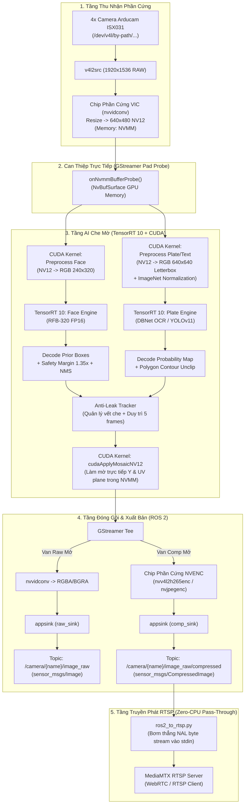

# 📷 Camera Stream & Privacy Anonymizer System (Jetson Orin)

Tài liệu này mô tả toàn bộ kiến trúc, luồng hoạt động dữ liệu (Dataflow), các cơ chế tối ưu phần cứng và hướng dẫn chỉnh sửa mã nguồn cho gói ROS 2 `camera_stream`.

---

## 📌 1. Giới thiệu tổng quan

Gói `camera_stream` phụ trách thu nhận hình ảnh từ **4 camera Arducam ISX031** (chuẩn giao tiếp V4L2/GMSL) trên nền tảng **NVIDIA Jetson Orin**, thực hiện che mờ bảo mật (khuôn mặt, biển số xe, chữ số) theo thời gian thực bằng GPU và đẩy luồng nén phần cứng phục vụ hiển thị / RTSP streaming.

### 🌟 Các đặc tính kỹ thuật cốt lõi:
1. **Zero-Copy NVMM Pipeline**: Toàn bộ luồng ảnh chạy trên bộ nhớ phần cứng NVIDIA (`video/x-raw(memory:NVMM)`, định dạng NV12), không copy dữ liệu thô qua RAM CPU.
2. **Dual-Engine AI Anonymizer**: Chạy đồng thời 2 mô hình AI bằng **TensorRT 10 (FP16)**:
   - **Face Engine**: Model siêu nhẹ Ultra-Lightweight Face Detection RFB-320 ($240 \times 320$).
   - **Plate & Text Engine**: Model DBNet / PP-OCRv4 Text Detector ($640 \times 640$) nhận diện biển số xe mọi góc nghiêng và các bảng chữ số. (Hỗ trợ chuyển đổi sang YOLOv11 chỉ bằng 1 dòng cấu hình).
3. **Bộ lọc chống rò rỉ (Anti-Leak Tracker)**: Tự động ghi nhớ và duy trì vết che qua nhiều khung hình (`hold_frames: 5`) khi AI bị drop frame do rung lắc xe hoặc mờ chuyển động.
4. **CUDA Mosaic Kernel**: Làm mờ dạng pixelated mosaic trực tiếp trên mặt phẳng Y và UV của buffer NVMM NV12, hoàn thành trong $< 0.1\text{ ms}$ trên GPU (0% CPU).
5. **Van thông minh (Lazy Publishing & Dynamic Valves)**: 
   - Khi **0 subscriber**: Đưa camera về `GST_STATE_READY` $\rightarrow$ dừng DMA cảm biến, tiêu thụ **0.0% CPU & 0% GPU**.
   - Điều khiển van độc lập cho nhánh Raw và Compressed.
6. **Zero-CPU RTSP Pass-Through**: Script Python `ros2_to_rtsp.py` nhận các gói tin H.265 đã nén phần cứng (~1.5 KB) và đẩy trực tiếp sang MediaMTX Server mà không cần giải mã lại (< 1% CPU).

---

## 🏗️ 2. Sơ đồ luồng làm việc (Dataflow Architecture)



---

## 📂 3. Cấu trúc thư mục & Bản đồ mã nguồn

```text
camera_stream/
├── CMakeLists.txt              # Cấu hình biên dịch C++/CUDA, RPATH OpenCV, liên kết thư viện
├── package.xml                 # Khai báo dependency ROS 2
├── README.md                   # Tài liệu kiến trúc và hướng dẫn (file này)
├── config/
│   └── camera_stream.yaml      # File cấu hình trung tâm (camera, kích thước, model AI, threshold)
├── include/camera_stream/
│   ├── camera_stream_node.hpp  # Khai báo class chính CameraStreamNode, quản lý GStreamer & ROS 2
│   ├── face_anonymizer.hpp     # Khai báo FaceAnonymizer, Anti-Leak Tracker
│   ├── mosaic_kernel.cuh       # Khai báo các CUDA kernel xử lý ảnh & mosaic
│   └── plate_detector.hpp      # Khai báo PlateDetector (hỗ trợ DBNet OCR & YOLO)
├── src/
│   ├── main.cpp                # Điểm khởi chạy (entry point) của ROS 2 node
│   ├── camera_stream_node.cpp  # Quản lý vòng đời GStreamer, lazy publishing, pad probe
│   ├── face_anonymizer.cpp     # Điều phối Face Model + Plate Detector + Anti-leak temporal
│   ├── mosaic_kernel.cu        # Hiện thực CUDA kernels (NV12 to RGB Letterbox, Mosaic NV12)
│   └── plate_detector.cpp      # Hiện thực inference TensorRT 10, giải mã DBNet & YOLO
├── launch/
│   ├── camera_stream.launch.py # Khởi chạy camera_stream_node kèm nạp cấu hình và LD_LIBRARY_PATH
│   ├── ros2_to_rtsp.py         # Node Python RTSP Streamer pass-through (tiêu thụ < 1% CPU)
│   ├── robot_config.json       # Cấu hình IP RTSP server, cổng, tài khoản và timeout
│   └── mqtt_teleop_camera_bridge.py # Cầu nối điều khiển camera qua MQTT
└── models/
    ├── face_model/
    │   ├── version-RFB-320.onnx
    │   └── version-RFB-320_fp16.engine      # Model TensorRT 10 cho khuôn mặt
    └── plate_model/
        ├── plate_ocr_det_640_fp16.engine    # Model DBNet / PP-OCRv4 (Đang chạy chính)
        ├── yolov11n_plate_fp16_640x480.engine# Model YOLOv11 640x480 (Tùy chọn)
        ├── yolov11n_plate_fp16_640x640.engine# Model YOLOv11 640x640 (Tùy chọn)
        └── yolov9t314_license_plate_detector_fp16.engine
```

---

## ⚙️ 4. Chi tiết các cơ chế kỹ thuật trọng tâm

### 4.1. Cơ chế Zero-Copy NVMM (Memory Mapping)
- Ảnh từ cảm biến được phần cứng VIC chuyển sang `video/x-raw(memory:NVMM)`.
- Tại hàm `CameraStreamNode::onNvmmBufferProbe()`, hệ thống dùng `NvBufSurfaceMap()` để lấy con trỏ VRAM trực tiếp tới 2 mặt phẳng:
  - `yPlane`: Chứa thông tin độ sáng (Luma - Y).
  - `uvPlane`: Chứa thông tin màu sắc (Chroma - UV đan xen).
- Mọi thao tác đổi màu, resize letterbox và làm mờ mosaic đều được thực thi qua con trỏ này trên GPU, **không có bước copy dữ liệu sang CPU RAM**.

### 4.2. Cơ chế Lazy Publishing & Dynamic Valves
Hàm `subscriberCheckTimer_` (chu kỳ 1.0 giây) đếm số lượng người đăng ký:
```cpp
size_t rawSubCount = camera->rawPublisher->get_subscription_count();
size_t compSubCount = camera->compressedPublisher->get_subscription_count();
```
- Nếu `rawSubCount + compSubCount == 0`: Gọi `gst_element_set_state(camera->pipeline, GST_STATE_READY)`. Cảm biến dừng bắn DMA, node tiêu thụ **0.0% CPU**.
- Nếu có người xem: Bật sang `GST_STATE_PLAYING`.
- Nếu chỉ có người xem `/compressed`: Van `raw_valve` đóng lại (`drop=TRUE`), ngắt hoàn toàn nhánh chuyển đổi màu RGBA trên CPU.

### 4.3. Dual-Engine Privacy Anonymizer
Trong `FaceAnonymizer::processFrame()`:
1. **Engine 1 - Khuôn mặt**: 
   - Gọi kernel `cudaPreprocessNV12ToRGBPlanar` biến đổi NV12 thành mảng RGB float kích thước $240 \times 320$.
   - Chạy `context_->enqueueV3(stream_)` trên model RFB-320.
   - Giải mã priors, áp dụng Safety Margin (nhân scale 1.35x và mở rộng trán/cằm) để che phủ trọn vẹn cả đầu.
2. **Engine 2 - Biển số & Chữ số**:
   - `PlateDetector::detect()` gọi kernel `cudaPreprocessNV12ToRGBPlanarYOLOLetterbox` với cờ `useImageNetNorm = true` để chuẩn hóa `(pixel - mean) / std` theo chuẩn ImageNet.
   - Hỗ trợ 2 kiến trúc model:
     - **DBNet (PaddleOCR)**: Đọc output tensor `[1, 1, 640, 640]`, nhị phân hóa bằng ngưỡng xác suất `0.20`, tìm polygon contours và mở rộng polygon bằng thuật toán `unclip` để bao trọn viền biển số.
     - **YOLO (YOLOv11/YOLOv9)**: Tự động chuyển qua giải mã Anchor box và chạy thuật toán NMS nếu nạp engine YOLO.

### 4.4. Bộ lọc chống nhấp nháy (Anti-Leak Tracker)
Để bảo đảm an toàn quyền riêng tư, khi xe di chuyển trên đường gồ ghề hoặc quay xe nhanh, AI có thể bị trượt nhận diện trong 1–2 khung hình:
- Cấu trúc `TrackedFace` lưu vết tọa độ bounding box cùng bộ đếm `holdRemaining = hold_frames` (mặc định 5 khung hình).
- Khi frame mới có box trùng khớp (IoU > 0.3): Cập nhật vị trí mượt mà và làm mới bộ đếm về 5.
- Khi frame mới bị trượt (AI không bắt được): Vị trí cũ vẫn được giữ nguyên để tiếp tục che mờ trong 5 frame tiếp theo, triệt tiêu hoàn toàn hiện tượng lộ mặt/biển số.

### 4.5. CUDA Mosaic Blurring Kernel
Hàm `cudaApplyMosaicNV12` trong [mosaic_kernel.cu](file:///f:/05_ROBOTTAP/SwiX/camera_stream/src/mosaic_kernel.cu):
- Chia vùng bounding box thành các khối vuông kích thước `mosaicSize` (mặc định 20 pixel).
- Tọa độ pixel trong từng khối được ánh xạ về pixel đại diện ở góc trái trên của khối (`blockStartX`, `blockStartY`).
- Cập nhật đồng thời cả mặt phẳng Y (độ sáng) và mặt phẳng UV (màu sắc) mà không gây vỡ màu hoặc lệch pha màu YUV420.

---

## 🛠️ 5. Hướng dẫn chỉnh sửa và tùy biến cho người sau

Toàn bộ cấu hình hệ thống được tập trung tại [config/camera_stream.yaml](file:///f:/05_ROBOTTAP/SwiX/camera_stream/config/camera_stream.yaml).

### 5.0. Tùy biến 4 chế độ che mờ độc lập (Mặt / Biển số / Cả 2 / Tắt)
Hệ thống cho phép bạn cấu hình độc lập tính năng che mặt và che biển số xe:

| Chế độ | `anonymize.enable` | `face.enable` | `plate.enable` | Tải tài nguyên GPU |
| :--- | :---: | :---: | :---: | :--- |
| **1. Bật cả 2 (Mặt + Biển số)** | `true` | `true` | `true` | Cả 2 Engine chạy song song (~3.2 ms), che toàn diện |
| **2. Chỉ che mặt** | `true` | `true` | `false` | Bỏ qua model biển số, tiết kiệm ~2.0 ms GPU, biển số rõ nét |
| **3. Chỉ che biển số** | `true` | `false` | `true` | Bỏ qua model mặt, tiết kiệm ~1.2 ms GPU, mặt người rõ nét |
| **4. Tắt cả 2** | `false` | `false` | `false` | **0.0% GPU / 0% CUDA**, không tốn tài nguyên |

#### Ví dụ file `config/camera_stream.yaml`:
```yaml
anonymize:
  enable: true            # true: BẬT module | false: TẮT toàn bộ (0% GPU)
  mosaic_size: 5          # Kích thước ô làm mờ Mosaic (pixel)
  hold_frames: 5          # Số frames duy trì vết che mờ

  # 1. BẬT / TẮT RIÊNG CHE MẶT
  face:
    enable: true          # true = BẬT che mặt | false = TẮT che mặt
    model_path: "models/face_model/version-RFB-320_fp16.engine"
    confidence_threshold: 0.20
    box_scale: 1.15

  # 2. BẬT / TẮT RIÊNG CHE BIỂN SỐ XE & CHỮ SỐ
  plate:
    enable: true          # true = BẬT che biển số | false = TẮT che biển số
    model_path: "models/plate_model/plate_ocr_det_640_fp16.engine"
    confidence_threshold: 0.20
    box_scale: 1.15
```

### 5.1. Muốn đổi model Biển số xe giữa DBNet và YOLOv11
Trong file `config/camera_stream.yaml`:

- **Nếu dùng DBNet Text/Plate (Nhận diện chữ số, biển vuông, biển dài, biển nghiêng mọi góc)**:
  ```yaml
  plate:
    enable: true
    model_path: "models/plate_model/plate_ocr_det_640_fp16.engine"
    confidence_threshold: 0.20   # Ngưỡng nhạy tối ưu cho DBNet Probability Map
    nms_threshold: 0.35
    box_scale: 1.15
  ```

- **Nếu muốn chuyển sang YOLOv11 Nano (Chuyên biệt biển số xe, siêu nhẹ ~1.7ms)**:
  ```yaml
  plate:
    enable: true
    model_path: "models/plate_model/yolov11n_plate_fp16_640x480.engine"
    confidence_threshold: 0.25   # Ngưỡng nhạy của YOLO Object Detection
    nms_threshold: 0.35
    box_scale: 1.15
  ```
> **Lưu ý**: Code C++ trong `PlateDetector` đã được lập trình **tự động nhận dạng cấu trúc tensor**, bạn không cần sửa code C++, chỉ cần đổi đường dẫn `model_path` trong file YAML!

### 5.2. Muốn điều chỉnh độ mờ hoặc mức độ bao phủ
Trong file `config/camera_stream.yaml`:
- **Độ to của hạt che mờ**: Sửa `mosaic_size: 20` (số càng lớn thì ô vuông càng to, độ che mờ càng đậm).
- **Mức độ bao bọc khuôn mặt**: Sửa `box_scale: 1.35` (1.35 = rộng hơn 35% so với box AI phát hiện để che cả tóc và cằm).
- **Độ nhạy phát hiện khuôn mặt**: Sửa `confidence_threshold: 0.20` (hạ xuống 0.15 nếu muốn nhạy hơn, tăng lên 0.30 nếu bị nhận nhầm đèn xe).
- **Thời gian giữ vết che khi mất dấu**: Sửa `hold_frames: 5` (số frame duy trì che mờ khi AI drop frame).

### 5.3. Muốn đổi cổng hoặc thiết bị Camera
Trong mục `cameras` của `config/camera_stream.yaml`:
```yaml
cameras:
  front:
    device: "/dev/v4l/by-path/platform-tegra-capture-vi-video-index0"
    image_topic: "/camera/front/image_raw"
    compressed_topic: "/camera/front/image_raw/compressed"
    flip_method: 0   # 0: giữ nguyên, 2: xoay lật 180 độ bằng phần cứng
```

---

## 🚀 6. Hướng dẫn Biên dịch & Vận hành

### 6.1. Cấu hình hệ thống lần đầu (Chỉ chạy 1 lần duy nhất trên Jetson)
Để đảm bảo toàn bộ hệ thống luôn tự động nhận diện OpenCV 4.10 CUDA:
```bash
echo "/opt/opencv_cuda/lib" | sudo tee /etc/ld.so.conf.d/opencv_cuda.conf
sudo ldconfig
```

### 6.2. Biên dịch Package
```bash
cd ~/Cyber_Swix_M1
colcon build --packages-select camera_stream
source install/setup.bash
```

### 6.3. Khởi chạy hệ thống Camera Stream
```bash
ros2 launch camera_stream camera_stream.launch.py
```

### 6.4. Khởi chạy luồng RTSP Streamer (Pass-Through < 1% CPU)
Ở một terminal khác:
```bash
source ~/Cyber_Swix_M1/install/setup.bash
python3 ~/Cyber_Swix_M1/src/extend/camera_stream/launch/ros2_to_rtsp.py
```

### 6.5. Kiểm tra và điều khiển nhanh qua ROS 2 CLI
- **Xem danh sách topic đang phát**:
  ```bash
  ros2 topic list | grep camera
  ```
- **Kiểm tra FPS thực tế**:
  ```bash
  ros2 topic hz /camera/front/image_raw/compressed
  ```
- **Bật/Tắt stream camera cụ thể qua Service**:
  ```bash
  # Bật camera trước:
  ros2 service call /multi_camera_rtsp_streamer/camera/front/enable std_srvs/srv/SetBool "{data: true}"
  # Tắt camera trước:
  ros2 service call /multi_camera_rtsp_streamer/camera/front/enable std_srvs/srv/SetBool "{data: false}"
  ```
- **Chọn hiển thị tổ hợp camera tùy ý**:
  ```bash
  ros2 topic pub --once /multi_camera_rtsp_streamer/select_cameras std_msgs/msg/String "{data: 'front,rear'}"
  ```
- **Điều khiển ĐỘNG tính năng che mặt & biển số xe lúc runtime (Không tắt node)**:
  ```bash
  # Bật/Tắt riêng che mặt:
  ros2 service call /camera_stream_node/anonymize/enable_face std_srvs/srv/SetBool "{data: false}"
  ros2 service call /camera_stream_node/anonymize/enable_face std_srvs/srv/SetBool "{data: true}"

  # Bật/Tắt riêng che biển số xe:
  ros2 service call /camera_stream_node/anonymize/enable_plate std_srvs/srv/SetBool "{data: false}"
  ros2 service call /camera_stream_node/anonymize/enable_plate std_srvs/srv/SetBool "{data: true}"

  # Bật/Tắt toàn bộ che mờ (tắt cả 2 hoặc bật cả 2):
  ros2 service call /camera_stream_node/anonymize/enable_all std_srvs/srv/SetBool "{data: false}"
  ros2 service call /camera_stream_node/anonymize/enable_all std_srvs/srv/SetBool "{data: true}"

  # Hoặc thay đổi bằng ros2 param:
  ros2 param set /camera_stream_node anonymize.face.enable false
  ros2 param set /camera_stream_node anonymize.plate.enable false
  ```

---

## 📋 7. Tóm tắt quy tắc bảo trì cho lập trình viên kế thừa

1. **Tuyệt đối không dùng `cv::Mat` hay chuyển đổi màu trên CPU** trong vòng lặp frame chính. Mọi thao tác xử lý ảnh thô phải thực hiện qua CUDA kernel trên `yPlane` và `uvPlane`.
2. **Không gọi API TensorRT cũ**: TensorRT 10 đã loại bỏ `enqueueV2`, `context->destroy()`, `engine->destroy()`. Hãy dùng Smart Pointer (`std::unique_ptr`, `std::shared_ptr`) và `context->enqueueV3(stream)`.
3. **Giữ cấu trúc Lazy Publishing**: Bất kỳ tính năng mới nào bổ sung vào pipeline cần tôn trọng cơ chế van (`raw_valve`, `comp_valve`) để đảm bảo xe không bị ngốn CPU/GPU khi đang ở trạng thái chờ.
